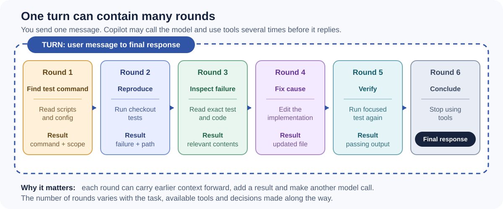
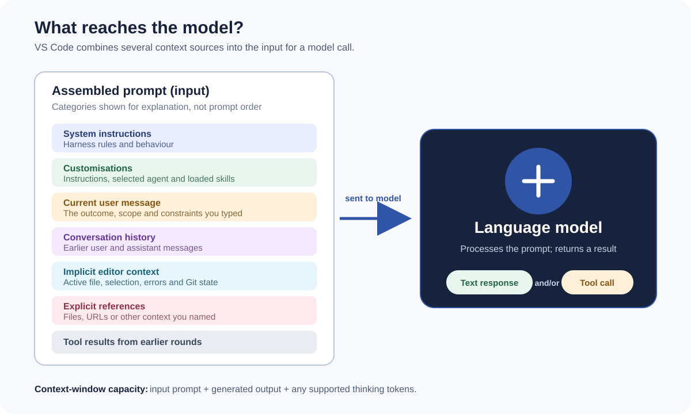

# Copilot terminology without the headache

| Page status | Intended audience | Last reviewed |
| --- | --- | --- |
| Draft glossary for internal review | Existing Copilot users new to agentic terminology | 8 August 2026 |

Copilot terminology becomes confusing because several products reuse the same words differently. You do not need to memorise everything on this page. Start with the fundamentals, then return to the extended terms when you encounter them.

> **If you remember only one idea:** Copilot is not just a model. A harness assembles context, gives the model tools and keeps calling it until the work is finished.

## On this page

- [Start here: seven terms worth knowing](#start-here-seven-terms-worth-knowing)
- [Fundamental terminology](#fundamental-terminology)
- [One turn can contain many rounds](#one-turn-can-contain-many-rounds)
- [Extended agent terminology](#extended-agent-terminology)
- [Customization terminology](#customization-terminology)
- [Context, state and memory terminology](#context-state-and-memory-terminology)
- [Tokens in more depth](#tokens-in-more-depth)
- [Usage and cost terminology](#usage-and-cost-terminology)
- [Four distinctions that prevent confusion](#four-distinctions-that-prevent-confusion)

## Start here: seven terms worth knowing

1. A **token** is a small unit of text processed by a model.
2. A **model** reads tokens and generates tokens.
3. **Context** is everything the model can see for its current call.
4. A **context window** limits how much can be seen at once.
5. A **tool** lets Copilot do something outside the model, such as read a file or run a test.
6. A **turn** is the exchange from your message to Copilot's final response.
7. A **round** is one internal pass through the model-and-tools loop. One turn can contain many rounds.

That is enough vocabulary to understand most of the rest of this wiki.

## Fundamental terminology

| Term | What it means here | Analogy |
| --- | --- | --- |
| **Token** | A unit of text processed or generated by a model. It may be a whole word, part of a word or punctuation. | A piece of building material. You buy and move pieces, not whole finished rooms. |
| **Model** | A particular large language model offered through Copilot. Models differ in capability, speed, context size and cost. | Vehicles are designed for different jobs. A car is useful for travel; a forklift is better for lifting a pallet. Some are faster, stronger or more efficient than others. |
| **Prompt** | The complete package sent to the model—not just the words you typed. It can include system instructions, history, files and tool results. | A briefing pack prepared before a meeting. |
| **Context** | Everything the model can see during its current call. Information outside the assembled prompt is invisible to it. | The material currently laid out on a workbench. |
| **Context window** | The maximum amount of context a model can process in one call, measured in tokens. | The size of the workbench. A larger bench holds more, but clutter can still make the job harder. |
| **User message** | The instruction or question you submit. It begins a user-visible turn. | A job ticket handed to a technician. |
| **Response** | The visible answer Copilot returns when the turn finishes. | The completed work and handover note. |
| **Chat** | The interface where you and Copilot exchange messages. | The service desk counter. |
| **Session** | One independent conversation with its own history and context. | A project room. Starting a new session gives you a clean room rather than dragging in every old box. |

## One turn can contain many rounds

For the user-facing VS Code experience, this wiki uses the terminology from Microsoft's coding-harness explanation:

- A **turn** starts when you submit one message and ends when Copilot returns its final response.
- A **round** is one pass through the loop: assemble the prompt, call the model, process its response, run any requested tools, record the results and decide whether to continue.
- The **agent loop** is the mechanism that keeps performing rounds until there is a final answer or a stop condition is reached.

For example, “find the failing test, fix it and verify the result” is one turn. Searching, reading, editing, testing and finally answering may take several rounds inside it.

### A genuine product terminology clash

The Copilot SDK documentation uses **turn** for what the VS Code harness article calls a **round**: one LLM call and its consequences. That SDK definition is useful when reading `assistant.turn_start` events, but it is not how the newer user-facing harness article distinguishes turns and rounds.

This wiki therefore uses:

| When discussing | Use |
| --- | --- |
| The experience from user message to final response | **Turn** |
| One internal model/tool iteration | **Round** |
| Copilot SDK event names or logs | Use the SDK's own **turn** wording and say that it is SDK-specific |

Always define the unit when reporting measurements. “Five turns” is otherwise impossible to interpret reliably.

## Extended agent terminology

| Term | Plain-English meaning | Analogy |
| --- | --- | --- |
| **Agent harness** | The product layer that assembles context, exposes and executes tools, manages the loop and adapts different models to the editor. | The vehicle around an engine: controls, dashboard, gearbox and safety systems. |
| **Agent** | A model operating through a harness with context and tools so it can perform work rather than only generate text. | A worker equipped with a brief, tools and a working process. |
| **Tool** | A callable ability such as reading a file, editing code, running a command or querying an external service. | A tool on the worker's bench. |
| **Tool call** | A model's structured request for the harness to execute a tool with particular arguments. | A work order saying which tool to use and how. |
| **Tool result** | The output returned after the harness executes a tool. It can become context in the next round. | The measurement or result produced by using the tool. |
| **Agent loop** | The repeated “think → act → observe → think again” process used to complete a turn. | Diagnose, try, inspect the result and adjust. |
| **Custom agent** | A reusable specialist definition with its own instructions, tools and optional model choice. | A named specialist role with a particular toolkit and operating brief. |
| **Subagent** | A separate agent invoked to handle delegated work, usually with an isolated context. | A specialist called in to investigate one part of the job. |
| **Orchestrator or parent agent** | The agent coordinating the overall task and delegating work. | A lead coordinating several specialists. |
| **Handoff** | Passing a task or a later stage of work to another agent or environment. | Transferring a job with a handover note. |
| **Autonomy** | How much an agent may do before it must pause for approval. | The spending and decision authority assigned to a role. |

## Customization terminology

| Term | Plain-English meaning | Best mental shortcut |
| --- | --- | --- |
| **Custom instructions** | Guidance automatically applied within a defined scope, such as a repository or file path. | Standing rules. |
| **`AGENTS.md`** | A file format for persistent repository guidance used by supporting AI agents. Discovery rules vary by product. | A local operating manual. |
| **Skill** | A task-specific package containing `SKILL.md` and optionally scripts, templates or reference material. It is loaded when relevant. | A playbook with supporting equipment. |
| **Prompt file** | A reusable prompt template that a person deliberately invokes. | A reusable job-request form. |
| **MCP server** | A Model Context Protocol server that exposes external tools or data to an AI application. | A standard adaptor to another system. |
| **Hook** | A command run at a configured lifecycle event, such as before a tool call or after an agent stops. | An automatic gate or trigger. |
| **Plugin** | An installable bundle that can package agents, skills, hooks and MCP configuration. | A toolbox delivered as one package. |

For help choosing between these, use [Choose the right Copilot technology](Copilot-Technologies/Choose-the-right-technology.md).

## Context, state and memory terminology

| Term | Meaning used in this wiki |
| --- | --- |
| **Conversation history** | Earlier user messages, assistant responses and relevant tool activity retained in the current session. |
| **Compaction** | Replacing older conversation detail with a shorter summary to create room in the context window. Some detail can be lost. |
| **Checkpoint** | An overloaded term. In Copilot CLI it can refer to a saved compaction summary. In VS Code it is a restore point used to roll back a session's file changes. |
| **Prompt cache** | A provider mechanism that reuses a matching prefix from earlier model input, potentially reducing cost and latency. |
| **Copilot Memory** | A supported mechanism for storing and later retrieving repository facts or user preferences. It is separate from one chat's context. |
| **Copilot Space** | A curated collection of instructions and sources used to ground Copilot Chat around a project or topic. |

## Tokens in more depth

You normally do not need to count tokens yourself. You do need to understand which direction they travel, because that affects context limits, latency and cost.

| Token type | What it represents | Simple analogy |
| --- | --- | --- |
| **Input tokens** | Everything sent to the model for the current round: system instructions, tool definitions, customizations, your message, history, files and earlier tool results. | Pages placed into the briefing pack. |
| **Output tokens** | Text or structured tool requests generated by the model. | Pages the model writes back. |
| **Cached input tokens** | An unchanged prefix of input that the provider can reuse from a previous model call. Exact pricing and eligibility depend on the model and product. | Reusing the unchanged first chapters of the briefing instead of processing them again at full cost. |
| **Thinking or reasoning tokens** | Tokens used by supported reasoning models while working through a problem. They may not appear in the final response but can affect usage, latency and context. | Private working notes used before presenting the answer. |

### Why a short message can still be a large input

Your ten-word message may sit on top of thousands of tokens of system instructions, tool descriptions, repository instructions, conversation history and retrieved files. The context diagram shows the full package:

Later rounds can also include the results of earlier searches, file reads and commands. This is why one short turn can consume much more than the text visible in the chat box.

See [Tokens and context windows](Tokens-and-Context-Windows.md) for practical context management.

## Usage and cost terminology

| Term | Plain-English meaning |
| --- | --- |
| **GitHub AI Credit** | GitHub's usage-based billing unit. One credit corresponds to USD $0.01, while token prices differ by model. |
| **Usage-based billing** | Billing derived from the model used and tokens consumed, converted into AI credits. |
| **Premium request** | A legacy request-based unit still applicable to certain existing annual individual plans. Do not mix it with AI-credit accounting. |
| **Rate limit** | A temporary restriction on request frequency or capacity. It is different from exhausting a budget. |
| **Budget or session limit** | A control used to cap or stop further AI-credit consumption. Availability depends on plan and surface. |

## Four distinctions that prevent confusion

### Model versus agent

The **model** reads and generates tokens. The **agent** is the useful working system: model plus harness, context and tools. Switching the model changes the engine; it does not replace the whole vehicle.

### Context versus memory

**Context** is what the model can see now. **Memory** is information stored for possible retrieval later. A fact can exist in memory or a repository file without being present in the current context.

### Skill versus tool

A **skill** supplies a workflow, guidance and supporting resources. A **tool** performs an operation. A debugging skill might instruct the agent to use search, terminal and file-editing tools.

### Instructions versus policy

**Instructions** influence model behaviour; they are not an enforcement boundary. Use permissions, approvals, hooks, branch rules and platform policy for controls that must not be bypassed.

## Sources

- [The coding harness behind GitHub Copilot in VS Code](https://code.visualstudio.com/blogs/2026/05/15/agent-harnesses-github-copilot-vscode)
- [Context assembly in VS Code](https://code.visualstudio.com/docs/agents/concepts/context)
- [Language models, context windows and thinking tokens in VS Code](https://code.visualstudio.com/docs/agents/concepts/language-models)
- [Copilot SDK agent loop and its SDK-specific definition of a turn](https://docs.github.com/en/copilot/how-tos/copilot-sdk/features/agent-loop)
- [Managing context in Copilot CLI](https://docs.github.com/en/enterprise-cloud@latest/copilot/concepts/agents/copilot-cli/context-management)
- [Trust and safety in VS Code: checkpoints and rollback](https://code.visualstudio.com/docs/agents/concepts/trust-and-safety)
- [Copilot customization cheat sheet](https://docs.github.com/en/copilot/reference/customization-cheat-sheet)
- [Usage-based billing for organizations and enterprises](https://docs.github.com/en/copilot/concepts/billing/usage-based-billing-for-organizations-and-enterprises)
- [Legacy request-based billing](https://docs.github.com/en/copilot/reference/copilot-billing/request-based-billing-legacy/github-copilot-premium-requests)
